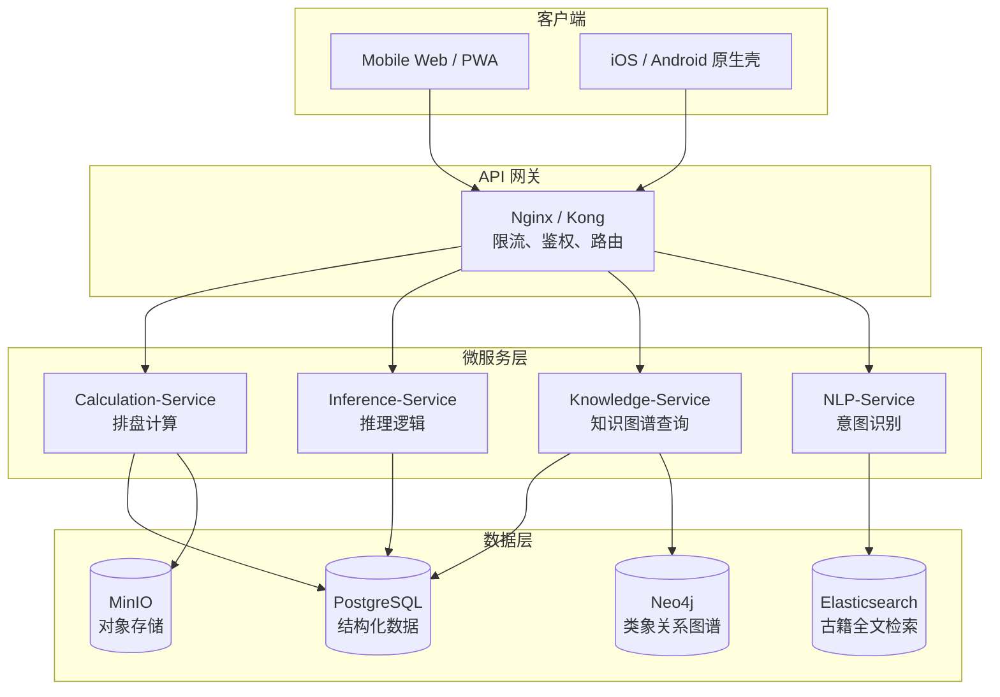
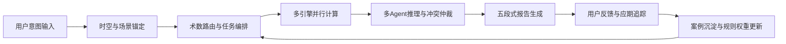
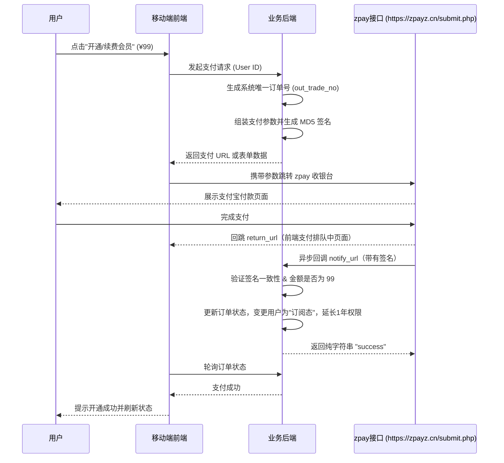

# **易枢（YiShu）智能术数推演系统**
## 产品需求文档（PRD）

| 属性 | 值 |
|------|----|
| **文档版本** | V1.3 |
| **创建日期** | 2026-03-07 |
| **最后更新** | 2026-03-09 |
| **产品负责人** | [待填写] |
| **技术负责人** | [待填写] |
| **状态** | 评审修订中 |

### 变更记录

| 版本 | 日期 | 变更内容 | 变更人 |
|------|------|----------|--------|
| V1.0 | 2026-03-07 | 初稿 | — |
| V1.1 | 2026-03-09 | 统一章节编号；增加 MVP 边界定义；收敛技术栈；增强 Roadmap；补充决策日志 | — |
| V1.2 | 2026-03-09 | 重新定位用户群体；新增商业模式与定价；新增支付集成规范 | — |
| V1.2.1 | 2026-03-09 | 修正术语错误；明确“全量愿景”与“MVP范围”对齐关系；补充MVP验收口径 | — |
| V1.3 | 2026-03-09 | 强化“AI玄学专家团队”定位；统一个人档案+事件信息为推演基础；明确多模型节点驱动的研发方向 | — |

---

## 1. 文档概述

### 1.1 产品定位
构建以**中国传统术数本体论**为主路径，并融合中西方占卜体系（塔罗、星座等）的智能推演应用；系统以“AI 玄学专家团队”方式协同服务用户，覆盖“命理推演、寻卜问卦、相术、风水、星象与塔罗”等场景，提供可解释、可追溯、可执行的综合建议。

### 1.2 目标用户

> **核心定位：面向普通用户与深度用户的“AI玄学专家团队”应用，以团队协作体验超越单一命理师。**

| 用户层级 | 画像 | 核心需求 | 使用频率 |
|----------|------|---------|----------|
| **游客用户**（未登录） | 初次体验、轻咨询用户 | 先填写个人底盘+事件信息，快速获得单次推演结论 | 单次或偶尔 |
| **注册用户**（登录态） | 持续决策需求用户、传统文化爱好者 | 自动复用个人档案、持续跟踪事件、获得“专家团队”连续服务 | 日活/周活 |

- **服务形态**：不是“单次算命工具”，而是“多专家节点协同的长期顾问服务”。
- **增长引擎**：游客态保留低门槛，但核心推演必须具备“个人档案+事件信息”两个输入面。

### 1.3 核心价值主张
> **"形式化古法逻辑，保留术数推演的可解释性，实现跨流派的综合研判"**

### 1.4 终端策略（Mobile-First）
- **主场景终端**：手机端（iOS/Android）为第一优先，Web端作为补充与后台管理入口
- **体验目标**：单手可完成核心起局流程（问询→排盘→断语查看→报告保存）
- **交互约束**：核心操作区适配拇指热区，避免依赖悬停与复杂多栏布局
- **能力优先级**：优先交付移动端传感器能力（摇卦、罗盘、相机采集、震动反馈）

### 1.5 商业模式与定价策略

| 层级 | 条件 | 功能范围 | 有效期 |
|------|------|---------|--------|
| **免费层（游客态）** | 无需注册 | 全部基础功能（排盘、运势、塔罗、测字、取名） | 永久 |
| **试用层（新注册）** | 手机号注册 | 全部功能 + 历史记录 + 个人主页 + 深度报告 | 注册后 3 个月 |
| **订阅层（付费会员）** | 试用到期后付费 | 同试用层 | ¥99/年 |

**核心策略说明：**

- **游客→注册转化**：游客可使用全部基础能力，注册的核心价值是「历史记录沉淀」和「每日个性主页」
- **试用→付费转化**：3 个月免费试用培养使用习惯，到期后以 ¥99/年（约 ¥8.25/月）低价转化
- **到期降级**：试用/订阅到期后自动降为游客态，历史数据保留（可查看但不可新增），付费后恢复
- **支付方式**：仅支持支付宝（通过 zpay 接口），详见 §21 支付集成规范
- **定价依据**：¥99/年 显著低于单次命理师咨询（通常 ¥200-500/次），强调"一年无限次专业级推演"的性价比

### 1.6 AI 专家团队原则（新增）

1. **团队化编排**：每次推演由多个功能节点协作完成（如命理节点、卦象节点、塔罗节点、星象节点、仲裁节点）。
2. **模型驱动优先**：各节点能力默认由 AI 大模型承载，规则库与算法引擎作为校验与约束层。
3. **注册用户增强**：注册用户优先复用个人档案，形成“连续上下文+连续服务”体验。
4. **证据链强制**：所有节点输出必须可追溯到盘面证据、规则证据或古籍证据。

---

## 2. 需求范围

### 2.1 功能需求（Functional Requirements）

#### 2.1.1 核心推演引擎（Core Engine）

| 模块 | 功能点 | 优先级 | 验收标准 |
|------|--------|--------|----------|
| **时空计算中心** | 真太阳时换算（含历史磁偏角校正） | P0 | 误差<1分钟，支持公元前722年-公元2200年 |
| | 节气精确计算（定气法/平气法切换） | P0 | 与《中国天文年历》数据一致 |
| | 历法转换（公历/农历/干支历/道历） | P1 | 支持年月日时四柱转换 |
| **式法排盘** | 奇门遁甲（转盘/飞盘/置闰/拆补/茅山） | P0 | 18局完整推演，值符值使计算准确 |
| | 大六壬（天地盘/四课三传/720课体） | P1 | 支持寻时、寻课、神煞全排 |
| | 太乙神数（九宫/积年/三基四辅） | P2 | 阳遁阴遁72局完整 |
| **易占排卦** | 六爻纳甲（世应/六亲/六神/伏神） | P0 | 支持铜钱摇卦、时间起卦、数字起卦 |
| | 梅花易数（体用/互卦/变卦/类象） | P0 | 支持外应录入（声音/方位/物象） |
| | 揲蓍法模拟（大衍筮法流程） | P2 | 动画演示四营三变过程 |
| **命学排盘** | 八字（子平/盲派/旺衰/格局双评） | P0 | 十神自动标注，大运流年精确排布 |
| | 紫微斗数（108星/庙旺利陷/四化飞星） | P1 | 支持三合/飞星/中天流派 |
| | 七政四余（果老星宗/制化关系） | P2 | 星盘宫位与神煞同参 |
| **堪舆工具** | 玄空飞星（三元九运/替卦/兼向） | P1 | 支持24山向，运盘/山盘/向盘飞布 |
| | 罗盘模拟（磁偏角校正/坐向测量） | P1 | 移动端磁力计集成，精度±0.5° |

#### 2.1.2 知识本体系统（Knowledge Ontology）

| 功能 | 描述 | 技术形式 |
|------|------|----------|
| **万物类象库** | 八卦/天干/地支/九星/八门等符号的类象映射 | 图数据库（Neo4j），支持语境权重调整 |
| **古籍条文库** | 《增删卜易》《滴天髓》《奇门法窍》等结构化抽取 | 本体标注（OWL），关联具体卦例/命盘 |
| **流派规则库** | 不同流派的冲突判定逻辑（如八字用神取舍） | Drools规则引擎，优先级可配置 |
| **案例验证集** | 历史名人命盘/已验证占例的复盘数据 | JSON-LD格式，支持版本控制 |

#### 2.1.3 智能推演逻辑（Inference Logic）

- **FR-INT-001** **多Agent推理**：排盘Agent→象义Agent→生克Agent→仲裁Agent的流水线协作
- **FR-INT-002** **冲突消解**：当奇门（吉）与六爻（凶）结论冲突时，按"时间精度优先"原则仲裁，并提供差异分析
- **FR-INT-003** **象义消歧**：根据问题类型（问病/问财/问官）动态调整符号权重（如"白虎"在病为凶，在武职为吉）
- **FR-INT-004** **应期计算**：支持"冲合应期"、"旬空应期"、"入墓出墓应期"等多维度时间推断
- **FR-INT-005** **专家团队编排**：按问题类型动态激活“术数节点+西方占卜节点+仲裁节点”，输出团队会诊结果
- **FR-INT-006** **档案驱动推演**：推演输入强制包含个人档案（姓名/性别/生辰/出生地）与事件信息（背景/时空/紧迫度）

#### 2.1.4 用户交互层（UI/UX）

- **FR-UI-001** **渐进式问询**：意图识别→时空锚定→情境补全的三步对话流
- **FR-UI-002** **可视化盘局**：SVG动态绘制式盘，支持宫位高亮、连线、飞星轨迹动画
- **FR-UI-003** **多维度报告**：生成包含"象辞-占断-类象-应期-变易"五段式的传统格式断语
- **FR-UI-004** **古籍对照**：推演结果自动关联相关古籍条文（如显示《黄金策》对应章节）
- **FR-UI-005** **移动端优先交互**：核心流程支持单手操作，触控目标≥44px，关键页面竖屏优先
- **FR-UI-006** **离线容错**：弱网下支持本地缓存最近排盘、断语草稿与历史报告摘要
- **FR-UI-007** **低操作高产出**：默认单页最少输入，自动补全可推断参数，首屏直接输出“总览+细分+建议+证据链”
- **FR-UI-008** **心理抚慰与情绪支持**：推断结果强制包含“心理学”视角的润色解读，为低谷期用户提供希望，绝对禁止传递无法化解的、打击性的宿命论断语。

#### 2.1.5 特色拓展模块（Feature Extensions）

| 模块 | 功能点 | 优先级 | 验收标准 |
|------|--------|--------|----------|
| **关系适配评估** | 事业合伙人评价（价值观/风险偏好/决策节奏） | P1 | 输出“协同指数+冲突点+合作建议”三段结构 |
| | 朋友关系适配评价（信任模式/边界感/互补性） | P1 | 输出“关系画像+相处建议+预警信号” |
| | 爱情关系适配评价（情感需求/沟通模式/阶段风险） | P1 | 输出“匹配度+阶段建议+禁忌事项” |
| **场域风水评估** | 住宅风水（户型/朝向/流年飞星） | P1 | 输出“问题位+调整位+优先改造项” |
| | 商铺风水（动线/财位/门向/人流） | P1 | 输出“客流建议+财位建议+风险位提醒” |
| | 办公室风水（工位/会议区/老板位/部门协同） | P1 | 输出“布局评分+优化动作清单” |
| **多元素旅游规划** | 旅游规划（实时安全性+旅游目的+伴侣/同行） | P1 | 输出“路线建议+风险提示+同行适配建议” |

### 2.2 非功能需求（Non-Functional Requirements）

| 类别 | 要求 | 指标 |
|------|------|------|
| **准确性** | 排盘计算零误差 | 通过《钦定协纪辨方书》等权威历书测试用例100%通过 |
| **性能** | 复杂推演响应时间 | 六爻/八字<500ms；奇门<1s；太乙<2s |
| **移动性能** | 首屏与交互延迟 | 首屏可交互<2.5s；交互响应<100ms；首包<1.5MB |
| **体验效率** | 用户操作最小化 | 核心查询≤3步完成；默认表单字段自动填充率≥70%；首屏结果信息卡≥6项 |
| **外部数据质量** | 实时数据可用性 | 安全数据源可用率≥99%；旅游风险数据更新时间≤10分钟 |
| **可解释性** | 推理过程透明 | 每个结论须显示推导路径（如"断吉原因：用神得月令生扶+动化回头生"） |
| **可维护性** | 流派规则热更新 | 不重启服务可更新规则库（如新增某盲派口诀） |
| **合规性** | 内容安全 | 凶格断语自动附加传统劝诫（如"积善之家必有余庆"），禁止绝对化宿命论表述 |

---

## 3. 用户场景与流程

### 3.1 核心用户故事

**场景A：职业命理师综合研判**
> 张先生（命理师）接到客户咨询事业发展，他使用"八字+奇门"双盘模式：
> 1. 输入客户生辰，系统自动排出八字（日主强弱分析）
> 2. 选择"当下提问时刻"，排出奇门局（看开门、日干、时干）
> 3. 系统提示："八字喜用神为水木，奇门局中开门临坎一宫得生，与命局喜用一致，主利北方发展"
> 4. 张先生查看"冲突分析"模块，确认两术数结论无矛盾，向客户出具报告

**场景B：学习者研究古籍案例**
> 李女士（爱好者）研读《增删卜易》某卦例：
> 1. 扫描书中干支信息，系统自动复现该卦盘
> 2. 点击"卦理分析"，显示原书断语与现代符号推演对比
> 3. 查看"类象网络"，了解"父母爻"在此语境下为何代表"文书"而非"长辈"

**场景C：低操作多结果的关系与出行决策**
> 王先生准备与合伙人开新店，并计划短期出行考察：
> 1. 输入本人信息后，系统自动补全历史参数，仅补充“合伙人信息+出行目的+同行关系”
> 2. 一次提交后输出：合伙协同建议、商铺风水重点、目的地实时安全提醒
> 3. 查看“风险优先级卡片”，直接得到“先做/后做/不建议做”的行动清单

### 3.2 关键流程图

```
[起局流程]
用户输入 → 意图识别（NLP）→ 术数路由决策 → 时空参数采集 → 历法校正 → 排盘引擎 → 多Agent推理 → 冲突仲裁 → 生成断语 → 关联古籍 → 可视化呈现

[知识检索流程]
符号查询（如"震卦"）→ 本体图谱展开 → 显示：基本象义/各流派差异/相关卦例/现代语境映射
```

---

## 4. 数据模型规范

### 4.1 核心实体关系（ER图关键）

```yaml
GanZhi（干支）:
  - id: "JiaZi_01"
  - gan: "甲"（阳木）
  - zhi: "子"（阳水）
  - nayin: "海中金"
  - relations:
    - sheng_wo: "癸"
    - wo_sheng: "丙"
    - chong: "午"
    - he: "丑（子丑合）"
    - xing: "卯（子卯刑）"

Paipan_Result（排盘结果）:
  - paradigm: "Qimen"  # 所属术数范式
  - timestamp: "2026-03-07T14:30:00+08:00"
  - location: {"lng": 116.4, "lat": 39.9}
  - pan_structure: {
      "gong": [
        {"position": "坎1", "tianpan": "天蓬", "dipan": "休门", "tianqian": "戊", ...},
        ...
      ],
      "zhi_fu": "天冲",
      "zhi_shi": "伤门"
    }

Interpretation_Rule（断语规则）:
  - condition: "Qimen && ri_gan == '丙' && shi_gan == '辛' && relation == '合'"
  - effect: "日月相会，主私谋暗合，测婚为三角关系"
  - source: "奇门法窍卷二"
  - priority: 0.8
  - applicable_query_types: ["婚姻", "合作"]
```

### 4.2 知识图谱Schema

- **节点类型**：Symbol（符号）、Classical_Text（古籍）、Case（案例）、Master（流派宗师）、Rule（规则）
- **核心边类型**：
  - `xiang_sheng`（相生）
  - `xiang_ke`（相克）
  - `transform_to`（动化）
  - `interpreted_by`（某古籍解释）
  - `conflicts_with`（与某流派观点冲突）

---

## 5. 技术实现方案

### 5.1 系统架构



### 5.2 MVP 推荐精简栈

> ❗ **注意**：上图为全量架构愿景。MVP 阶段建议采用精简栈，降低运维复杂度，后续按需拆分。

| 层 | MVP 方案 | 全量方案（Phase 3+） |
|----|----------|------------------|
| **前端** | Next.js 14+ (App Router) + TypeScript | React Native / Flutter |
| **后端 API** | Next.js API Routes 或 FastAPI (Python) | Go/Rust 微服务 |
| **数据库** | PostgreSQL (Supabase) + pgvector | + Neo4j + Elasticsearch |
| **AI 集成** | Claude / GPT API + RAG | + 自研规则引擎 + Drools |
| **部署** | Vercel (前端) + Railway/Fly.io (API) | K8s 容器化 |

### 5.3 全量架构技术选型

| 模块 | 技术方案 | 选型理由 |
|------|----------|----------|
| **历法计算** | 自研算法+Skyfield库 | 精确处理历史历法和真太阳时 |
| **规则引擎** | Drools | 支持复杂业务规则热更新，适合术数流派规则 |
| **图数据库** | Neo4j | 完美适配五行生克、干支关系等网络结构 |
| **排盘算法** | Rust实现核心计算 | 保证高精度历法计算性能 |
| **可视化** | D3.js + SVG | 灵活绘制各类术数盘局 |

---

## 6. 项目里程碑（Roadmap）

### 6.0 MVP 范围声明

> **MVP 遍界原则：先跑通“输入→排盘→AI断语→古籍引证”核心闭环，再扩术数广度。**

| 类别 | 包含在 MVP | 不包含在 MVP（后续 Phase） |
|------|-----------|------------------------|
| **核心计算** | 八字排盘、六爻纳甲、梅花易数 | 奇门、大六壬、太乙、紫微斗数 |
| **知识库** | 古籍引证（对照/检索）+ 基础类象 | 图数据库、流派冲突仲裁 |
| **AI 能力** | 节点化多模型编排（核心节点可先共用主模型）+ 结构化断语生成 | 全量多Agent协作、双术互证、四维同参 |
| **视觉分析** | — | 相术 CV、掌纹识别、骨相分析 |
| **3D/AR** | — | 户型图识别、罗盘 AR、飞星 3D |
| **规则引擎** | 硬编码规则 | Drools 热更新 |
| **平台** | Mobile Web（响应式） | 原生 App（iOS/Android） |
| **西方体系** | 塔罗抽牌、星座查询 | 完整星盘、吐陶占星 |
| **登录态** | 游客态可用 + 注册态档案复用 + 手机号登录 + 3月免费试用 + zpay 支付宝订阅（¥99/年） | OAuth、多支付渠道 |

### 6.0.1 MVP 验收口径（强制）

| 验收项 | MVP通过标准 |
|------|-------------|
| 核心闭环 | 可完成“输入→排盘→AI断语→古籍引证→报告保存” |
| 输入完备性 | 每次推演必须具备“个人档案+事件信息+起局时空” |
| 术数范围 | 八字、六爻、梅花三类均可独立完成一次推演 |
| 结果结构 | 至少包含“总览、证据链、建议、风险”四段 |
| 内容合规 | 禁止绝对化宿命论，输出包含心理抚慰表达 |
| 移动可用 | 竖屏主流程可单手完成，关键触控区≥44px |

### 6.0.2 开发推进规则（强制）

1. 所有开发任务必须显式映射到 PRD 条目（FR/NFR/Phase）。
2. 任何偏离 PRD 的实现，必须先更新 PRD 再实施代码变更。
3. 每次迭代完成后，必须同步“开发进度跟踪表”状态与证据链接。

### Phase 1：基建与核心（MVP）- 3个月

| 任务 | 前置依赖 | 验收标准 |
|------|----------|----------|
| 历法计算引擎 | 无 | 与《中国天文年历》对拍，误差＜1分钟 |
| 六爻纳甲与梅花易数 | 历法引擎 | 100 条已知试例回归通过 |
| 基础八字排盘 | 历法引擎 | 十神、大运、流年与 `lunar-javascript` 交叉验算一致 |
| 免登录每日运势 + 塔罗 | 八字排盘 | 游客态可用，AI 断语可读 |
| 玄青暗金主题 UI | 无 | 符合 UI/UX 规范检查清单，移动端可用 |
| AI 断语生成 | 排盘引擎 + 古籍数据入库 | 断语可读且附古籍引证链接 |

- **交付物**：可独立运行的 Mobile Web 易占+命学模块

### Phase 2：式法扩展 - 3个月

| 任务 | 前置依赖 | 验收标准 |
|------|----------|----------|
| 奇门遁甲（转盘+飞盘） | 历法引擎 | 18局完整推演，值符值使计算准确 |
| 大六壬（四课三传） | 历法引擎 | 支持寻时、寻课、神煞全排 |
| 多 Agent 推理框架 | Phase 1 AI | 编排Agent→象义Agent→仲裁Agent 可跑通 |
| 古籍条文关联系统 | 古籍数据入库 | RAG Top3 命中率≥85% |

- **交付物**：三式齐备的推演系统

### Phase 3：命学与堪舆 - 4个月

| 任务 | 前置依赖 | 验收标准 |
|------|----------|----------|
| 紫微斗数全功能 | `iztro` 集成 | 支持三合/飞星/中天流派 |
| 玄空风水（飞星排盘） | 历法引擎 | 24山向，运/山/向盘飞布正确 |
| 面相/体相参数化录入 | CV 模型 | MediaPipe 关键点检测精度±2mm |
| 流派冲突仲裁机制 | 多 Agent | 同输入重复计算一致率≥99.5% |

- **交付物**：综合术数平台

### Phase 4：智能增强 - 2个月

| 任务 | 前置依赖 | 验收标准 |
|------|----------|----------|
| NLP意图识别优化 | Phase 2 Agent | 意图分类准确率≥90% |
| 古籍 OCR 与结构化 | 古籍数据 | 字符识别率≥95% |
| 用户反馈闭环系统 | Phase 1 登录态 | 登录用户日反馈提交率≥20% |
| 移动端罗盘集成 | AR 能力 | 精度±0.5° |

- **交付物**：智能化应用

### 6.5 开发进度跟踪（按 PRD）

> 更新规则：每次合并前必须更新本表；状态仅允许 `未开始 / 进行中 / 已完成 / 阻塞`。

| PRD 条目 | 当前状态 | 本轮进展 | 代码证据 |
|---------|---------|---------|---------|
| FR-UI-001 渐进式问询 | 已完成 | 已实现“意图识别→时空锚定→情境补全”三步流程与分步校验 | `src/app/start/page.tsx` |
| FR-UI-003 多维度报告 | 进行中 | 已支持分段阅读、视图切换、复制与下载；五段式仍待补齐 | `src/app/start/page.tsx` |
| FR-UI-004 古籍对照 | 进行中 | 已接入基础古籍引证，未实现章节级检索与跳转 | `src/lib/classical-references.ts` |
| FR-UI-006 离线容错 | 进行中 | 已落地问询草稿与上次报告摘要本地缓存，弱网回显可用 | `src/app/start/page.tsx` |
| FR-UI-007 低操作高产出 | 进行中 | 默认最少输入，自动追加意图与情境上下文后再推演 | `src/app/start/page.tsx` |
| FR-INT-005 专家团队编排 | 未开始 | 当前仍为单链路推演，尚未实现节点级多模型编排 | — |
| FR-INT-006 档案驱动推演 | 进行中 | 已改为个人档案+事件信息输入；登录态可保存档案复用 | `src/app/start/page.tsx` |
| Phase 1 AI 断语生成 | 进行中 | 已打通推演 API + OpenRouter + 基础历法上下文 | `src/app/api/inference/route.ts` |
| Phase 1 游客态能力 | 已完成 | 游客可直接推演；结果页与案例库均可见游客态提示与引导 | `src/app/start/page.tsx` |
| Phase 1 历史记录沉淀 | 进行中 | 已完成按账号隔离的案例保存/查询；未实现跨端同步与导出 | `src/app/api/cases/route.ts` |
| Phase 1 移动端优先 | 进行中 | 基础样式可用，尚未完成拇指热区专项验收 | `src/app/globals.css` |
| 支付集成（zpay） | 未开始 | 无 | — |
| 手机号登录与试用 | 进行中 | 已实现验证码登录、30天会话、90天试用状态判定与过期拦截 | `src/app/api/auth/verify-code/route.ts` |
| 六爻/梅花真实排盘引擎 | 未开始 | 当前仍以 AI 推理为主，缺少算法级排盘 | — |

---

## 7. 风险评估与对策

| 风险 | 影响 | 对策 |
|------|------|------|
| **历法争议** | 不同古籍节气算法差异（如子平法的"节"与"气"） | 提供"严格模式/宽松模式"切换，标注算法来源 |
| **流派冲突** | 不同派别用户争论规则正确性 | 明确标注"本结果基于XX流派"，提供多派别对比视图 |
| **合规监管** | 封建迷信内容风险 | 增加"学术模式"（侧重文化研究）与"咨询模式"（侧重心理建设），禁用绝对化断言 |
| **计算精度** | 古代时辰换算争议（如"早子时/晚子时"） | 提供历法学术界的多种算法选项，由用户自选 |

---

## 8. 附录

### 8.1 术语表
- **真太阳时**：考虑经度差和均时差的真实太阳时，区别于标准时区时间
- **四课三传**：大六壬的排盘结构，课为现状，传为发展
- **入墓**：五行处于衰败状态（如辰为水之墓），奇门与六爻中的重要概念

### 8.2 参考古籍清单
- 易学类：《周易正义》《御纂周易折中》《来注易经图解》
- 术数类：《御定奇门宝鉴》《大六壬指南》《增删卜易》《滴天髓》
- 堪舆类：《地理辨正》《青囊序》《沈氏玄空学》

### 8.3 决策跟踪日志（Decision Log）

| ID | 待决策事项 | 影响范围 | 状态 | 决策结论 | 决策日期 |
|----|----------|---------|------|---------|--------|
| DEC-001 | 是否支持用户自定义流派规则（如某家传口诀）？ | 规则引擎、知识库 | ⏳ 待定 | — | — |
| DEC-002 | 案例库是否开放用户贡献（UGC模式）？ | 数据治理、合规 | ⏳ 待定 | — | — |
| DEC-003 | 是否接入第三方支付？ | 商业模式、合规 | ✅ 已决策 | zpay 支付宝，¥99/年订阅制 | 2026-03-09 |
| DEC-004 | MVP 技术栈：全 TypeScript 还是 TS + Python 双栈？ | 架构、招聘 | ⏳ 待定 | 建议 TS + Python | — |
| DEC-005 | 历法引擎：自研还是基于 `lunar-javascript` 封装？ | Phase 1 进度 | ⏳ 待定 | 建议先集成后自研 | — |
| DEC-006 | 部署方案：Vercel + Railway 还是自建服务器？ | 运维成本、性能 | ⏳ 待定 | — | — |

---

**文档维护**：本PRD需每两周根据技术评审更新一次，重大架构调整需走变更流程。

---

## 9. 相术视觉分析系统（Physiognomy CV Module）

### 功能架构（FR-PHY-001 ~ FR-PHY-009）

| 功能ID | 功能点 | 技术规格 | 传统术数映射 |
|--------|--------|----------|--------------|
| **FR-PHY-001** | **多角度面部采集** | 支持正脸（0°）、左轮廓（45°/90°）、右轮廓（-45°/-90°）、仰视、俯视共7个标准位 | 《麻衣神相》要求"三停平等，五岳朝拱"需立体观察 |
| **FR-PHY-002** | **三停五岳自动标定** | 基于人脸68/106关键点检测，自动划分：上停（发际-印堂）、中停（印堂-鼻准）、下停（人中-地阁）；标注额（南岳）、鼻（中岳）、颏（北岳）等 | 误差允许范围：±2mm（以鼻根为基准比例尺） |
| **FR-PHY-003** | **十二宫ROI分割** | 自动框选命宫（两眉间）、财帛宫（鼻）、夫妻宫（眼角）等12区域，支持用户手动微调 | 关联知识图谱中的宫位-流年-吉凶数据库 |
| **FR-PHY-004** | **气色五行量化** | 提取面部HSV色彩空间，映射至"青赤黄白黑"五色，结合光照校正算法（避免白平衡干扰） | 春青/夏赤/秋白/冬黑/四季黄的时令权重调整 |
| **FR-PHY-005** | **骨相辅助判断** | 通过正侧脸轮廓线计算"骨角"突出度（额角、鼻骨、颧骨），结合深度学习模型估算骨骼结构 | 对应"九骨"（天庭骨、枕骨等）的数字化类比 |
| **FR-PHY-006** | **手相全景拼接** | 支持掌心、掌背、指节分区域拍摄，自动拼接为完整手形图 | 区分"掌为虎/指为龙"的形法基础 |
| **FR-PHY-007** | **掌纹主线识别** | 检测生命线、智慧线、感情线、命运线、太阳线，计算：深浅、断裂、岛纹、分叉等特征 | 采用U-Net分割模型，需训练古代手相图谱标注集 |
| **FR-PHY-008** | **掌型五行分类** | 基于手掌长宽比、指掌比例、厚度，自动分类金木水火土五型掌 | 金掌方/木掌长/水掌圆/火掌尖/土掌厚 |
| **FR-PHY-009** | **流年标记系统** | 在掌纹/面部叠加流年坐标（如"生命线35岁位置"、"面相山根41岁"），支持点击查询当年运势 | 关联八字大运数据，实现"相命同参" |

### 数据模型规范（增补）

```yaml
Facial_Analysis:
  subject_id: "用户匿名ID"
  capture_metadata:
    angles: {"front": true, "left_45": true, "left_90": false}
    lighting: {"temperature": 5500, "lux": 300}  # 光照条件记录
    timestamp: "ISO8601"
  landmarks: {
    "yintang": [x, y],  # 印堂
    "nose_tip": [x, y], # 鼻准
    "philtrum": [x, y]  # 人中
  }
  measurements: {
    "upper_stop": 58.2,  # 上停长度mm
    "middle_stop": 52.1,
    "lower_stop": 60.3,
    "three_stop_balance": 0.87  # 三停均衡度指数
  }
  regions: [
    {"name": "命宫", "bbox": [x1,y1,x2,y2], "color_wuxing": "赤", "intensity": 0.7}
  ]
  bone_structure: {
    "forehead_angle": 135,  # 额角弧度
    "cheek_prominence": 0.82  # 颧骨突出度0-1
  }

Palm_Analysis:
  hand_type: "木型掌"
  handedness: "右手"  # 男左女右/惯用手校正
  main_lines: {
    "life_line": {
      "path": [[x1,y1], [x2,y2], ...],  # 贝塞尔曲线控制点
      "features": [{"type": "island", "position": 0.3, "age": 28}]  # 岛纹在28岁位置
    }
  }
  fingers: {
    "index_length": 72,
    "ring_length": 74,
    "ratio": 0.97  # 食指无名指长度比（雄性激素指数关联）
  }
```

### 交互流程设计

**面相分析流程：**
```
1. 引导拍摄 → 显示7个虚线框引导用户调整角度
2. 质量检测 → 自动检测：是否正面/光照是否均匀/是否有眼镜遮挡/是否表情自然（非大笑）
3. AI标定 → 自动画出三停线、五岳点，用户可拖拽微调（传统相法强调"气定神闲"，需允许人工校正）
4. 特征提取 → 计算各宫位形、神、气指标
5. 关联推演 → 调取八字数据（如已知），验证"相与命合"（如八字忌火而面色赤红，加重凶性判断）
6. 生成报告 → 分部位解读（如"颧骨横张配三角眼，主强势克夫"），附改善建议（如"修眉柔化眉峰"）
```

**手相分析特殊处理：**
- **左右手逻辑**：提供"男左女右"/"先天左手后天右手"/"双手并看"三种模式
- **掌纹清晰度增强**：若拍摄质量差，提供手绘描线工具（用户沿掌纹描绘后系统识别）
- **流年交互**：在时间轴上滑动，掌纹对应位置高亮，显示该年岁运

---

## 10. 三维空间风水分析系统（3D Feng Shui Module）

### 核心功能（FR-3D-Feng-001 ~ FR-3D-Feng-008）

| 功能ID | 功能点 | 技术实现 | 术数依据 |
|--------|--------|----------|----------|
| **FR-3D-Feng-001** | **户型图智能识别** | 上传CAD/PNG/PDF，AI识别墙体、门窗、阳台、楼梯；自动生成拓扑图 | 《阳宅十书》形法基础 |
| **FR-3D-Feng-002** | **罗盘方位校准** | 用户拍摄大门/阳台外景，AR叠加罗盘；或手动输入精确度数（支持磁偏角校正） | 24山向精度要求±1.5° |
| **FR-3D-Feng-003** | **玄空飞星3D叠加** | 根据坐向和建筑年代，在3D户型图上叠加九星飞布（一白/二黑...），不同宫位用颜色/高度区分 | 支持运盘/山盘/向盘/流年盘切换 |
| **FR-3D-Feng-004** | **形煞自动检测** | 识别外部形煞（路冲、反弓水、天斩煞）和内部形煞（穿堂煞、梁压顶、厕居中宫） | 基于户型几何分析与外景图像识别 |
| **FR-3D-Feng-005** | **八宅游年排布** | 输入宅主命卦（东四命/西四命），计算八门九星在3D空间中的吉凶方位 | 生气/天医/延年/伏位四吉方高亮 |
| **FR-3D-Feng-006** | **纳气口分析** | 标记大门、窗户、阳台为纳气口，计算气口与坐向的夹角，判断"正神/零神"得位否 | 玄空学"正神正位装，泼水入零堂" |
| **FR-3D-Feng-007** | **商业空间特殊算法** | 针对商铺：收银台（财位）、大门（纳气）、厕所（退气）的三角关系分析；办公室：老板位（坐山）、财务室（库）、大门（向） | 结合奇门遁甲"开休生"三吉门方位 |
| **FR-3D-Feng-008** | **化解方案3D预览** | 在3D模型中模拟摆放化解物（如屏风、水晶、植物），实时显示对飞星/气流的影响 | 物理遮挡与五行生克的联合计算 |

### 技术架构补充

**3D引擎层（新增）：**
```
[Three.js/WebGL]
  ├── 户型建模：ExtrudeGeometry拉伸墙体，CSG布尔运算处理门窗洞口
  ├── 飞星可视化：InstancedMesh渲染9宫格，颜色映射（一白蓝/二黑黑/三白碧...）
  ├── AR罗盘：WebRTC获取视频流，Three.js叠加3D罗盘模型，DeviceOrientation控制旋转
  └── 光照模拟：DirectionalLight模拟太阳轨迹，验证"采光纳气"（如冬至阳光是否入宅）
```

**空间分析算法：**
- **缺角检测**：将户型外接矩形与多边形对比，计算各卦位缺角比例（>1/3为严重缺角）
- **穿堂风计算**：门窗连线向量分析，判断是否"前通后通，人财两空"
- **动静分区**：基于房间功能标签（卧室/客厅/厨房），验证"静宜坐山/动宜向方"

### 数据输入规范

```yaml
Space_Analysis:
  space_type: "住宅" | "商铺" | "办公室"
  geometry:
    floor_plan: "SVG路径数据或坐标点数组"
    scale: 1:100  # 比例尺
    floors: ["一层", "二层"]  # 复式/别墅支持多层
  orientation:
    sitting: 172.5  # 坐向度数（子山午向为0/180）
    facing_door: 355.0  # 大门朝向
    magnetic_declination: -5.5  # 磁偏角（北京约-5.5°）
  temporal:
    construction_year: 2018  # 建造年份决定元运（2018为下元八运）
    renovation_date: "2024-03"  # 装修动土日期（换运判断）
  residents:
    owner_birth: "1985-06-15"  # 用于计算命卦（东四命/西四命）
    owner_minggua: 2  # 坤卦
  analysis_results:
    xuankong:
      yun_pan: [4,9,2,3,5,7,8,1,6]  # 运盘数字（中宫起运星）
      shan_pan: [...],  # 山盘（坐山星盘）
      xiang_pan: [...]  # 向盘（向首星盘）
    defects:
      [{"type": "缺角", "position": "西北", "gua": "乾", "severity": 0.8}]
```

---

## 11. 技术架构调整（Technical Architecture Update）

### 新增服务层

```
[CV-Service]（Python + OpenCV + PyTorch）
  ├── Face-Analysis-API：
  │   └── 模型：MediaPipe FaceMesh（68/468点）+ 自定义CNN（气色分类）
  ├── Hand-Analysis-API：
  │   └── 模型：YOLOv8（手掌检测）+ U-Net（掌纹分割）+ ResNet（掌型分类）
  └── Space-Analysis-API：
      └── 户型识别：YOLOv8（门窗检测）+ 传统CV（霍夫变换直线检测）

[3D-Visualization-Service]（Node.js + Three.js）
  ├── 户型渲染引擎
  ├── 飞星动画生成
  └── AR罗盘合成

[Knowledge-Graph-Update]
  ├── 新增节点类型：Facial_Feature（面相特征）、Palm_Pattern（掌纹模式）、Spatial_Defect（形煞）
  ├── 新增关系类型：
  │   ├── face_implies（面相特征-命运关联）
  │   ├── palm_confirms（手相-八字互证）
  │   └── space_affects（空间布局-居住者关联）
```

### 模型训练数据需求

| 模型 | 数据来源 | 标注要求 | 数量级 |
|------|----------|----------|--------|
| **气色识别** | 传统面相图谱+中医面色图 | 五行五色分类（考虑光照干扰） | 5K+张 |
| **掌纹分割** | 古籍手相图+现代采集图 | 生命线/智慧线/感情线像素级标注 | 10K+张 |
| **户型识别** | 公开户型图+CAD图纸 | 墙体/门/窗/家具 bounding box | 20K+张 |
| **骨相评估** | 历史人物肖像+3D头骨数据 | 九骨位置标注 | 2K+张 |

---

## 12. 隐私与伦理强化（Privacy & Ethics Enhancement）

### 生物特征数据保护（新增风险）

**风险等级：极高**
- **面部数据**：属敏感个人信息，需符合《个人信息保护法》
- **手掌数据**：含掌纹（唯一生物特征），禁止原始图像云端存储

**对策：**
1. **边缘计算**：面相/手相分析在**本地设备**完成（WebAssembly/TensorFlow.js），仅上传特征向量（关键点坐标，非图像）
2. **数据脱敏**：面部照片自动添加不可见水印（防截屏），72小时后强制删除原始图像
3. **用户授权**：明确告知"相不独论"，AI分析仅供参考，需结合八字等其他信息
4. **未成年人保护**：检测面部年龄<18岁，自动拒绝面相分析（传统术数不占童子）

### 风水分析合规

- **免责声明**："风水分析基于传统环境心理学与建筑学，不涉及封建迷信"
- **科学关联**：将"穿堂煞"解释为"气流速度过快导致体感不适"，提供加装门帘/屏风的空气动力学解释

---

## 13. 增补里程碑（Updated Roadmap）

### Phase 1增补：视觉基础（+2个月）
- [ ] MediaPipe人脸关键点集成
- [ ] 三停五岳自动标定算法
- [ ] 基础掌型分类模型
- [ ] **交付物**：可拍摄分析面相基础指标（三停比例）

### Phase 2增补：空间模块（+3个月）
- [ ] 户型图识别与3D重建
- [ ] 24山向AR罗盘
- [ ] 玄空飞星3D可视化
- [ ] **交付物**：上传户型图可查看飞星分布与形煞提示

### Phase 3增补：精细分析（+3个月）
- [ ] 气色五行识别（需解决光照鲁棒性）
- [ ] 掌纹流年标记（主线识别准确率>85%）
- [ ] 相命同参（面相与八字数据交叉验证）
- [ ] **交付物**：完整相术视觉报告

---

## 14. 关键交互原型示意

**面相分析界面：**
```
[相机视图]
  ├─ 虚线框（引导摆正脸）
  ├─ 实时提示："请收下巴，展示地阁" / "左转45度观察颧骨"
  └─ 拍摄后 → 显示网格线（上停/中停/下停）+ 十二宫标签（可拖拽修正）

[分析结果页]
  ├─ 3D头像旋转查看（基于多角度照片重建）
  ├─ 热点图：点击"财帛宫"查看鼻型分析（梁柱/鼻孔/准头）
  └─ 气色趋势图：建议每月拍照对比，追踪"气运变化"
```

**风水3D界面：**
```
[户型3D视图]
  ├─ 罗盘控件（可旋转/锁定）
  ├─ 图层切换：[原始结构] [飞星盘] [八宅游年] [气流模拟]
  ├─ 热点标记：红色=凶位（五黄/二黑），绿色=吉位（一白/六白）
  └─ 化解建议：拖拽家具模型（如"在此处放置屏风"），实时看到煞气阻断效果
```

此增补将应用从**纯时间维度**（八字/奇门）扩展至**空间维度**（风水）与**形体维度**（相术），形成"**天时-地利-人和-形相**"的四维术数体系。

---

## 15. 应用逻辑完善（Application Logic Enhancement）

### 15.1 统一业务闭环（从输入到复盘）



- **统一原则1：先采集后推断**  
  在进入排盘前必须完成最小必要参数校验（时间、地点、问题域、身份模式）。
- **统一原则2：先证据后结论**  
  任一断语必须绑定证据链，至少包含：盘面证据、规则证据、古籍证据、冲突说明。
- **统一原则3：先仲裁后输出**  
  多术数并用时，先生成分术结果，再输出仲裁结论，禁止直接拼接文本。

### 15.2 多术数协同模式（新增）

| 模式ID | 模式名称 | 输入要求 | 输出特性 | 适用场景 |
|------|------|------|------|------|
| **COL-001** | 单术快速模式 | 最小参数集 | 单盘结论+证据链 | 普通咨询 |
| **COL-002** | 双术互证模式 | 命盘+时盘 | 一致性评分+冲突说明 | 职业命师 |
| **COL-003** | 四维同参模式 | 命盘+时盘+相术+空间 | 综合结论+多维权重图 | 高价值决策 |

### 15.3 结果一致性与冲突强度指标（新增）

- **一致性评分（Consistency Score）**：衡量多术结果趋同程度，范围0-100。  
- **冲突强度（Conflict Level）**：按低/中/高分层，决定是否触发人工复核。  
- **仲裁可信度（Arbitration Confidence）**：展示最终结论置信度，低于阈值时自动提示“仅供研究参考”。  

---

## 16. 功能分层与服务编排规范

### 16.1 六层能力架构

1. **交互层（Experience Layer）**：对话问询、盘面可视化、3D空间与相术采集界面。  
2. **编排层（Orchestration Layer）**：意图解析、术数路由、参数补全、任务调度。  
3. **计算层（Computation Layer）**：历法中心、排盘引擎、视觉分析、空间分析。  
4. **认知层（Cognitive Layer）**：规则引擎、知识图谱、冲突仲裁、证据链生成。  
5. **资产层（Asset Layer）**：案例库、规则版本库、模型评测集、反馈数据。  
6. **治理层（Governance Layer）**：合规审查、权限审计、隐私策略、观测告警。  

### 16.2 服务编排契约（Service Contract）

#### 编排输入（Orchestration Input）
```json
{
  "query_type": "事业|婚姻|健康|风水",
  "user_mode": "学术|咨询|学习",
  "time_context": {
    "datetime": "ISO8601",
    "timezone": "Asia/Shanghai",
    "calendar_mode": "定气|平气"
  },
  "location_context": {
    "lng": 116.4,
    "lat": 39.9
  },
  "enabled_paradigms": ["Bazi", "Qimen", "LiuYao", "Physiognomy", "FengShui"]
}
```

#### 编排输出（Orchestration Output）
```json
{
  "final_judgement": "结构化结论",
  "consistency_score": 78,
  "conflict_level": "medium",
  "evidence_chain": [
    {
      "source_type": "rule|classical_text|chart",
      "source_ref": "奇门法窍卷二",
      "reasoning": "日干时干相合"
    }
  ],
  "safety_guardrail": {
    "risk_level": "normal",
    "message": "结果仅供参考，建议结合现实决策"
  }
}
```

---

## 17. 质量验收与迭代治理

### 17.1 新增验收指标（补齐“可落地”口径）

| 指标域 | 指标项 | 验收标准 |
|------|------|------|
| **工程质量** | 核心服务可用性 | 月度SLA≥99.9% |
| **推理质量** | 证据链覆盖率 | 关键结论100%带证据链 |
| **协同质量** | 多术仲裁稳定性 | 同输入重复计算一致率≥99.5% |
| **模型质量** | 面相/掌纹识别精度 | 核心任务F1≥0.85 |
| **业务质量** | 用户复盘完成率 | 30日应期回填率≥40% |
| **合规质量** | 高风险断语拦截率 | 100%拦截绝对化宿命表达 |

### 17.2 迭代节奏治理（新增）

- **双周版本节奏**：每两周固定一次规则与模型版本评审。  
- **灰度发布机制**：新增流派规则先进入5%用户灰度，验证稳定后全量。  
- **回滚标准**：冲突强度高比例异常上升>20%时，自动回滚至上个稳定版本。  

### 17.3 关键里程碑重排建议（在原Roadmap基础上）

1. **MVP优先闭环**：优先打通“输入-排盘-仲裁-报告-反馈”闭环，再扩术数广度。  
2. **先治理后扩展**：在相术/风水全面上线前完成隐私与合规模块。  
3. **先互证后自动化**：先上线双术互证，再推进四维同参自动仲裁。  

---

## 18. AI大模型能力矩阵与选型建议（2026最新版）

### 18.1 选型原则

- **规则可验证优先**：LLM仅负责语义理解、解释生成、证据组织，不替代确定性排盘计算。  
- **主备双活优先**：所有关键节点均配置主模型与备用模型，支持故障切换与成本切换。  
- **深度推理隔离**：对逻辑仲裁极度消耗算力的环节，专门隔离分配给 Reasoning 模型（如 R1/o3-mini）。
- **可控输出优先**：通过结构化输出（JSON Schema）+ 规则后处理保障稳定性与合规性。  

### 18.2 需要 AI 大模型支持的功能节点（主备模型+理由）

| 功能节点 | 关联需求ID | 推荐大模型（主） | 备用大模型 | 推荐理由 |
|------|------|------|------|------|
| **意图识别与编排** | FR-UI-001 | Claude 3.7 Sonnet | Gemini 2.0 Flash | Claude 3.7 交互与结构化路由能力属于最高梯度；Gemini 2.0 Flash 是极佳的低成本高并发备选 |
| **象义消歧与权重解释** | FR-INT-003 | OpenAI o3-mini | Claude 3.7 Sonnet | o3-mini 的深度思考过程（CoT）能完美应对“一象多义”的复杂推导 |
| **冲突分析与仲裁生成** | FR-INT-002 | DeepSeek-R1 | OpenAI o1 | 逻辑运算的重灾区，强化学习推理模型（Reasoning）的数学/逻辑闭环能力完美解决术数规则冲突 |
| **五段式断语生成** | FR-UI-003 | DeepSeek-V3 | Qwen-Max | DeepSeek-V3 兼具极强语义表达能力和超高API性价比，中文古文理解深刻 |
| **古籍检索增强与对照** | FR-UI-004 | Claude 3.7 Sonnet | DeepSeek-V3 | Claude 3.7 极少产生检索幻觉，引证对应极其精准且上下文窗口充足 |
| **案例复盘与规则提炼** | 案例验证集 | DeepSeek-R1 | OpenAI o3-mini | 提炼和归纳复杂的因果关系，正是强化学习推理模型的主场 |
| **合规改写与风险提示** | NFR-合规性 | Claude 3.7 Sonnet | GPT-4o | 涉及安全和合规拦截，Claude 3.7 对安全边界的把控和语气柔和度的拿捏最成熟 |
| **OCR后古籍结构化** | Phase 4 | Gemini 2.0 Pro | Qwen-VL-Max | 对古籍版式的理解需要原生多模态识别与超大上下文（2M tokens），Gemini 2.0 Pro 无可替代 |

### 18.3 API 接入方案建议（OpenRouter 聚合架构）

> **结论推荐：强烈建议使用 OpenRouter 或类似的大模型聚合网关，而非逐个注册原生 API Key。**

**为什么不推荐“单个原生大模型 API Key 堆叠配置”？**
1. **账号风控极高**：OpenAI / Anthropic 的原生 API 极容易因为网络环境或绑卡问题被封控，且充值极其繁琐（需要各种海外卡/币圈支付）。
2. **开发对接成本高**：每个模型的 SDK 格式、鉴权方式、报错机制都不一样（如 OpenAI 走 `openai`包，Claude 走 `anthropic` 包，Gemini 走 `@google/genai`），会给后端开发带来灾难性的冗余代码。
3. **主备双活难实现**：如果官方 API 接口当机（如 Claude 时常波动），前端无法低成本做到“自动 fallback 到同级别备用模型”。

**OpenRouter / 中转网关方案优势：**
1. **统一 API 格式**：只需维护一套 OpenAI SDK 格式的代码，仅通过 `model: "anthropic/claude-3.7-sonnet"` 或 `model: "deepseek/deepseek-r1"` 的字符串切换，就能调用全世界所有顶级大模型。
2. **自动 Fallback（Fallback Routing）**：可以在请求配置中写明：如果 Claude 超时，自动请求 R1，不需要写重试业务代码。
3. **资金池管理**：只需对 OpenRouter 充值一次，余额全模型通用，无需分别去 5 家不同的官网绑卡、管理剩余额度。

### 18.4 不建议使用大模型的节点（边界约束）

- **历法换算、节气计算、干支推导**：必须采用确定性算法引擎。  
- **奇门/六爻/八字/飞星排盘核心**：必须由规则与数值计算实现。  
- **几何与空间度量（缺角、穿堂风、角度）**：采用几何算法与3D引擎，不走LLM。  

### 18.5 运行策略（主备切换机制示例）

```yaml
LLM_Router:
  strategy:
    primary: "quality_first"
    fallback: "latency_or_cost_first"
  switch_conditions:
    - p95_latency_ms > 3500
    - parse_success_rate < 98%
    - safety_violation_rate > 0.5%
  output_contract:
    format: "json_schema"
    mandatory_fields:
      - final_judgement
      - evidence_chain
      - conflict_level
      - safety_guardrail
```

### 18.6 AI 大模型系统提示词（System Prompt）最佳实践

为保证各个 AI 节点的输出质量与产品核心价值高度一致，此处定义 System Prompt 的最高约束法则（后端模型集成时必须作为系统级上下文注入）：

1. **绝对的情绪底线（The Empathy Rule）**：“你现在是一个兼具传统术数智慧与现代心理学咨询技巧的智者。很多用户是带着焦虑和对未来的迷茫来寻求答案的。**你永远不能**给予用户无法改变的、毁灭性的宿命论结论。当盘象凶险时，你的重点必须放在‘如何规避风险’、‘如何通过行为改变结果’和‘如何获得心理成长’上，必须给处于低谷中的人提供可落地的希望。”
2. **直击痛点的结论先行（The See-Get-Do Rule）**：“在生成报告时，拒绝长篇大论的神棍式寒暄。第一句话必须用所有普通人都能听懂的大白话直接给出这局的定性结论与核心建议。接着再以倒金字塔的结构去解释盘面的天干地支五行流转是怎么推导出这个结论的。”
3. **严密的证据链（The Evidence-Based Rule）**：“任何一条决断都必须具有术数本身的证据支撑（例如：‘因为日干克时干，且开门逢空’）。严禁生造古籍内容，如果有古籍对照必须给出确切出处；如果没有，则单纯进行盘面五行生克的逻辑论证。”
4. **格式稳定性（The Format Rule）**：“必须严格遵守定义的 JSON Schema，不允许在大语言模型的返回中加入任何解释性 Markdown 标记或与 JSON 结构无关的感谢话语，确保应用解析不出错。”

---

## 19. 登录态分层与移动端优先体验

### 19.1 用户状态定义

| 状态 | 说明 | 转换条件 |
|------|------|----------|
| **游客态**（未登录） | 全量基础能力，即查即走，不做历史关联 | 注册→试用态 |
| **试用态**（新注册） | 全部功能 + 历史记录 + 个人主页 + 深度报告 | 注册后 3 个月内自动生效 |
| **订阅态**（付费会员） | 同试用态 | 支付 ¥99/年 后激活 |
| **到期态**（试用/订阅过期） | 降为游客态功能，历史数据保留（可查看不可新增） | 续费→订阅态 |

- **登录方式**：手机号验证码登录（Mobile Web 优先）
- **到期提醒**：试用期剩余 7 天/3 天/1 天时推送提醒；订阅到期前 15 天开始提醒
- **降级流程**：到期当天自动降级，不删除数据，并在首页展示“开通会员恢复全部功能”引导

### 19.2 功能矩阵（按用户状态）

| 功能 | 游客态 | 试用态/订阅态 | 到期态 |
|------|------|------------|--------|
| 测字 | ✅ | ✅ | ✅ |
| 取名字 | ✅ | ✅ | ✅ |
| 看命盘（中式） | ✅ | ✅ | ✅ |
| 看星盘（西式） | ✅ | ✅ | ✅ |
| 查星座 | ✅ | ✅ | ✅ |
| 看运势（八字/星座/塔罗） | ✅ | ✅ | ✅ |
| 历史记录 | ❌ | ✅ | 只读（不可新增） |
| 跨天关联分析 | ❌ | ✅ | ❌ |
| 每日个人主页 | ❌ | ✅ | ❌ |
| 深度报告 | ❌ | ✅ | ❌ |
| 反馈与评分 | ❌ | ✅ | ❌ |

### 19.3 中西体系融合策略（不改变产品主线）

- **主线不变**：中国传统术数为主结论。  
- **辅助增强**：西方占卜用于补充说明、风险侧写与可读性增强。  
- **权重策略**：中式 70% + 西式 30%。  
- **输出规范**：所有“最终结论”必须标注“中式主结论 + 西式辅助证据”。  

### 19.4 登录用户个人主页（Daily Hub）

登录用户每日打开默认进入个人主页，展示：

1. **今日总览卡**：事业、爱情、财运、健康。  
2. **今日宜忌卡**：宜事、忌事、幸运色、穿搭建议。  
3. **证据链卡**：中式主线依据 + 西式辅助依据。  
4. **反馈卡**：当日准度评分（1-5分）。  

### 19.5 数据留存与合规边界

- **留存策略**：登录用户数据长期留存，提供“一键删除全部历史”。  
- **游客策略**：默认不存储个人历史，不做跨会话关联。  
- **高风险场景策略**：医疗/法律/投资类问题统一输出风险提示与降级建议，不输出绝对化判断。  

### 19.6 验收标准（新增）

| 验收项 | 标准 |
|------|------|
| 游客态隐私边界 | 游客退出后不可检索到历史记录 |
| 登录首开转化 | 手机号验证码登录成功率≥98% |
| 每日主页可用性 | 登录用户100%可进入当日主页 |
| 反馈采集率 | 登录用户日反馈提交率≥20%（首期目标） |

---

## 20. 术数书籍TXT数据增强方案

### 20.1 数据资产现状

- 已具备中国传统术数古籍 TXT（原文/注解）数据，位于“术数书籍数据”目录。  
- 数据可直接用于知识检索、规则抽取与解释增强，不改变现有排盘引擎的确定性计算边界。  

### 20.2 优先增强节点（已确认）

1. **RAG 引证增强（P0）**  
   - 在断语结果中附“古籍原文引用 + 章节来源”。  
   - 目标：提升可解释性与专业可信度。  

2. **规则抽取入库（P0）**  
   - 从古籍与注解中抽取“条件-结论”规则，转为结构化规则条目。  
   - 目标：沉淀可计算知识库，增强中式主线推演质量。  

### 20.3 数据处理流水线

```text
TXT清洗 -> 段落切分 -> 术语标准化 -> 向量索引 -> RAG召回 -> 证据链输出
                                   \-> 规则抽取 -> 规则审核 -> 规则引擎
```

### 20.4 关键数据结构（建议）

| 表/集合 | 关键字段 | 说明 |
|------|------|------|
| classics_chunks | book_id, title, chapter, content, embedding | RAG 检索分片 |
| classics_terms | term, aliases, category, definition | 术语标准化字典 |
| classics_rules | rule_id, source_book, trigger, conclusion, confidence | 可计算规则 |
| evidence_links | session_id, result_id, source_refs | 结果与古籍证据链映射 |

### 20.5 上线策略与风险控制

- **先引证后自动化**：先上线“可追溯引证”，再逐步开放自动规则参与仲裁。  
- **人工审核闸门**：新抽取规则进入灰度前必须通过规则审核。  
- **冲突回退**：若新规则导致冲突率异常上升，自动回滚至上一稳定规则集。  

### 20.6 验收标准（新增）

| 验收项 | 标准 |
|------|------|
| 证据链覆盖率 | 中式结论100%可追溯到古籍片段 |
| 规则入库质量 | 抽取规则人工抽检准确率≥90% |
| 检索相关性 | RAG Top3 命中可用证据率≥85% |
| 线上稳定性 | 新规则灰度阶段无P0事故 |

---

## 21. 支付集成规范（zpay）

### 21.1 支付接口基本信息

- **接口平台**：zpay（兼容易支付协议）
- **接口地址**：`https://zpayz.cn/`
- **支付方式**：仅支持支付宝（`type="alipay"`）
- **定价金额**：`99.00` 元（试用到期后续费一年的费用）

### 21.2 支付与开通流程



### 21.3 参数及签名验证规范

- **签名生成规则**：
  1. 将所有参数按参数名 ASCII 码从小到大排序（`sign`、`sign_type` 和空值不参与）。
  2. 拼接为 URL 键值对形式：`a=b&c=d`。
  3. 进行 MD5 加密：`md5(拼接字符串 + 商户密钥PKEY)`，结果转为小写。
- **回调（notify_url）处理要求**：
  1. **必须验证签名**：只有签名一致，才认可支付。
  2. **校验金额**：必须校验返回的 `money` 是否等于商户侧订单的金额（防止篡改金额）。
  3. **并发锁**：更新发货处理前必须检查订单状态是否已处理防止重复发货。
  4. **正确返回**：处理成功后必须打印纯字符串 `success`，不能带任何其他多余字符或 HTML 标签。

### 21.4 资产安全规范（Security Guardrails）

> [!CAUTION]
> **绝对禁止**将 zpay 的商户 ID（PID）和 商户密钥（PKEY）硬编码或明文写在前端代码、PRD 文档或公开的 Git 仓库中。必须：
> 1. 均配置为后端的环境变量环境配置（如 `.env` 配置）。
> 2. 所有的支付参数打包计算和签名校验逻辑**必须都在后端执行**。
> 3. 开发交接时只能通过安全内网密钥管理工具下发给对应的开发人员。
